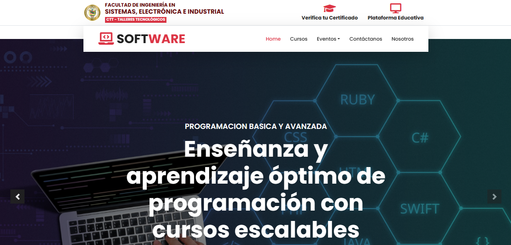

# Sistema de Gestión de Cursos y Eventos Académicos - FISEI
Sistema web desarrollado para la gestión integral de eventos académicos (cursos, congresos, webinars, conferencias, socializaciones, etc.) en la Facultad de Ingeniería en Sistemas, Electrónica e Industrial (FISEI) de la Universidad Técnica de Ambato. Permite administrar eventos, gestionar inscripciones, generar reportes y certificados, con un sistema robusto de roles y control de acceso.
## Tabla de Contenidos
1. [Introducción](#introducción)
2. [Funcionalidades Principales](#funcionalidades-principales)
3. [Tecnologías Utilizadas](#tecnologías-utilizadas)
4. [Estructura del Proyecto](#estructura-del-proyecto)
5. [Requisitos Previos](#requisitos-previos)
6. [Instalación](#instalación)
7. [Uso y Ejemplo de Flujo](#uso-y-ejemplo-de-flujo)
8. [Despliegue](#despliegue)
9. [Colaboración y Git Flow](#colaboración-y-git-flow)
10. [Equipo de Desarrollo](#equipo-de-desarrollo)
11. [Licencia](#licencia)
12. [Agradecimientos](#agradecimientos)

---


## Introducción

- Este sistema nace como una solución académica y colaborativa para la gestión eficiente de eventos y cursos en FISEI. El objetivo es digitalizar y automatizar procesos como la inscripción, control de asistencia, gestión de pagos y generación de certificados, aplicando buenas prácticas de desarrollo, control de versiones y trabajo en equipo.

---

## Funcionalidades Principales

- Gestión completa (CRUD) de eventos académicos: cursos, congresos, webinars, conferencias y socializaciones.
- Administración de organizadores y participantes con control de roles: Administrador, Responsable y Participante.
- Inscripción inteligente: verificación automática de requisitos y validación de perfil del usuario.
- Generación y descarga de órdenes de pago personalizadas para eventos pagos.
- Carga, validación y aprobación/rechazo de comprobantes de pago por parte de los responsables.
- Control de asistencia y registro de calificaciones/notas para eventos tipo curso.
- Generación automática de reportes de asistencia, notas y certificados en PDF.
- Recuperación de contraseña mediante token seguro enviado por correo electrónico.
- Búsqueda avanzada y filtrado de eventos por nombre, categoría, carrera, tipo, horas, etc.
- Interfaz moderna, responsiva y dinámica con Bootstrap y DataTables (idioma español).
- Seguridad: autenticación, control de sesiones, validación de formularios y protección de rutas.
- Gestión de usuarios con baja lógica (INACTIVO) y recuperación de cuentas.
---

📈 Evidencias de Desarrollo

---

## Tecnologías Utilizadas
- **Lenguaje:** PHP, JavaScript
- **Frontend:** HTML, CSS, Bootstrap
- **Base de datos:** MySQL Server, phpMyAdmin
- **Control de versiones:** Git + GitHub
- **Gestión de cambios:** Jira Service Management
- **Librerías:** DataTables, PHPMailer

---

## Estructura del Proyecto


├── .vscode/                  Configuración de VSCode
├── config/                   Archivos de configuración (DB, constantes, etc.)
├── controllers/              Controladores (MVC - lógica de control)
├── core/                     Núcleo del sistema (helpers, enrutador, clases base)
├── models/                   Modelos (MVC - acceso a datos, lógica de negocio)
├── public/                   Recursos públicos (CSS, JS, imágenes)
    ├── vendor/                   Dependencias externas (Composer)
        ├── auth.php                  Lógica de autenticación
├── views/                    Vistas (MVC - interfaz de usuario)
│   └── partials/             Fragmentos reutilizables (headers, footers, etc.)
├── .gitignore                Archivos/carpetas ignoradas por Git

├── CONTRIBUTING.md           Guía para colaboradores del proyecto
└── README.md                 Descripción general del proyecto

---

## Requisitos Previos
- PHP 8.x
- MySQL Server
- Composer
- Node.js (solo para herramientas de desarrollo, opcional)
- XAMPP/WAMP/LAMP recomendado para entorno local
- Git


---

## Instalación

1. **Clona este repositorio:**
   ```bash
   git clone https://github.com/Desarrolladores-Sistema-de-Eventos/Sistema_Eventos.git
   cd Sistema_Eventos
   ```

2. **Configura la base de datos:**
 ---

3. **Configura el entorno:**
   - Ajusta rutas y parámetros en los archivos de configuración según tu entorno local.
4. **Inicia el servidor local:**
   - Si usas XAMPP/WAMP, coloca el proyecto en la carpeta `htdocs` o `www`.
   - Accede desde tu navegador a: `http://localhost/Sistema_Eventos/`

---

## Uso y Ejemplo de Flujo

1. **Inicio de sesión:** Accede con un usuario administrador o crea uno desde la base de datos.
2. **Gestión de eventos:** Crea, edita o elimina eventos académicos desde el panel de administración.
3. **Inscripción:** Los participantes pueden inscribirse a eventos, subir comprobantes y consultar su estado.
4. **Validación:** El responsable revisa y aprueba/rechaza comprobantes de pago.
5. **Asistencia y notas:** Se registra la asistencia y, en cursos, la nota final.
6. **Reportes y certificados:** Al finalizar el evento, se generan reportes y certificados descargables.
7. **Recuperación de contraseña:** Si un usuario olvida su contraseña, puede solicitar un enlace de recuperación vía email.


---

## Despliegue

- Utiliza un servidor web compatible con PHP 8+ y acceso a SQL.
- Asegura los permisos de las carpetas `public/` y `vendor/`.

---

## Colaboración y Git Flow

Este proyecto utiliza **Git Flow** para la gestión de ramas. Para colaborar:

1. Inicializa git flow en tu clon local:
   ```bash
   git flow init
   ```
   (Sigue las instrucciones para definir las ramas principales: `main` y `develop`)

2. Crea una rama de funcionalidad:
   ```bash
   git flow feature start nombre-de-la-funcionalidad
   # Realiza tus cambios y commits
   git flow feature finish nombre-de-la-funcionalidad
   ```

3. Para hotfixes:
   ```bash
   git flow hotfix start nombre-del-hotfix
   # Cambios y commits
   git flow hotfix finish nombre-del-hotfix
   ```

4. Sube tus cambios y abre un Pull Request en GitHub.

> Consulta el archivo [CONTRIBUTING.md](CONTRIBUTING.md) para más detalles sobre el flujo de trabajo y buenas prácticas.

---

## Equipo de Desarrollo

- Cristian Jurado
- Josue Llumitasig
- Andrea Vásquez
- Bryan López
- Dennis Quisaguano
- Ariel Cholota

---

## Licencia
Este proyecto es de uso académico y no cuenta con una licencia comercial.

---

## Agradecimientos
A la Universidad Técnica de Ambato, FISEI y a los docentes de la carrera de Software por su guía y acompañamiento en el desarrollo de este proyecto.

¿Listo para contribuir o desplegar? ¡Sigue la guía y únete al desarrollo!
